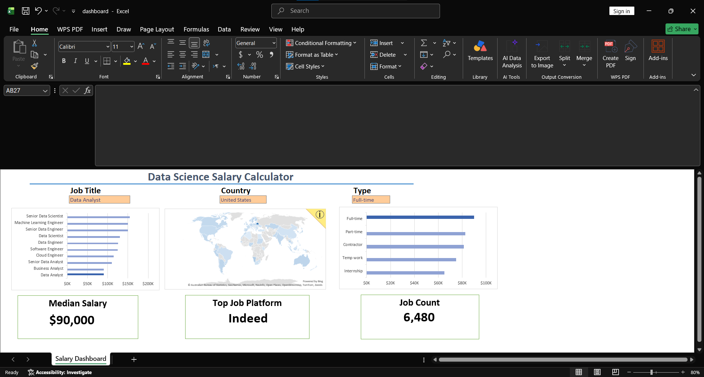

# Data Science Salary Calculator (Guided Practice Project)

## 📊 Overview
This is an interactive Excel dashboard designed to analyze global data science salaries, job roles, and employment types. This project was completed as part of a guided learning track by **Luke Barousse** to master fundamental data analysis, dashboard design, and data visualization techniques in Excel.

🔗 **[👉 Click here to interact with the Live Dashboard on Excel Online!](https://1drv.ms/x/c/158d6e049067066c/IQCazuFo860pR6VxCyQsZuweAZfhOgpi74cYJsE5Ru4WHss?e=QsAIeU)**

## 🗺️ Visual Preview

## ⚡ Skills Practiced & Demonstrated
* **Data Visualization:** Built geographical map charts, horizontal bar charts, and clean KPI blocks.
* **Interactivity:** Implemented Excel slicers and data validation dropdowns for dynamic filtering.
* **Formulas & Functions:** Practiced data aggregation and cleaning methodologies.
* **Dashboard Design:** Learned professional layout design, user experience formatting, and color palettes.

## 🤝 Credits & Learning Source
* **Instructor:** Luke Barousse
* **Project Type:** Guided Tutorial Portfolio Piece
* This project served as my foundational step into data analytics. My next repositories will feature independent projects using original datasets!
